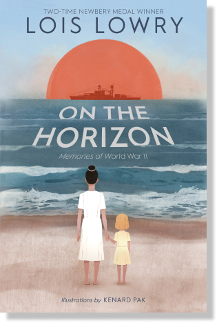

# Books

A books shop website model

#### AUTHOR: _Lois Lowry_

# ON THE HORIZON

On the Horizon tells the story of people whose lives were lost or forever altered by the twin
tragedies of **Pearl Harbor and Hiroshima**. Composed of poems about individual sailors who lost
their lives on the Arizona and about the citizens of Hiroshima who experienced unfathomable
horror.

> “I liked the feeling of love,' [Jonas] confessed. He glanced nervously at the speaker on the wall, reassuring himself that no one was listening. 'I wish we still had that,' he whispered. 'Of course,' he added quickly, 'I do understand that it wouldn't work very well. And that it's much better to be organized the way we are now. I can see that it was a dangerous way to live.'
> ...'Still,' he said slowly, almost to himself, 'I did like the light they made. And the warmth.”

> ― Lois Lowry, The Giver

## A Complete book selling sample web site frontend

---

# Building tools here-

- Html5
- CSS3
- Bootstrap
- JavaScript

---

## Features

1. Responsive
2. User Friendly Interface
3. Multiple display size supported
4. Animation and CSS
5. Interactive to Users

**HTML SAMPLE**

```HTML
<div class="container text-center">
    <div class="row">
        <div class="col-md-7 col-sm-12">
            <h6>AUTHOR: Lois Lowry</h6>
            <h1>ON THE HORIZON</h1>
            <p>On the Horizon tells the story of people whose lives were lost or forever altered by the twin tragedies of Pearl Harbor and Hiroshima. Composed of poems about individual sailors who lost their lives on the Arizona and about the citizens of Hiroshima who experienced unfathomable horror.
            </p>
            <button class="btn-light px-5 py-2">Buy Now</button>
        </div>
        <div class="col-md-5 col-sm-12 h-25">
            
        </div>
    </div>


</div>
```

**CSS SAMPLE**

```CSS
* {
  margin: 0;
  padding: 0;
  box-sizing: border-box;
}
header,
section {
  overflow-x: hidden;
}

:root {
  --display-font: "Playfair Display", serif;
  --Snigle-font: "Sniglet", cursive;
  --Rubik: "Rubik", cursive;
  --Patua: "Patua One", cursive;
  --Lobster: "Lobster", cursive;
  --light-black: #2e2c2caf;
  --bggradient: radial-gradient(#a75912, #050300);
  --light-grey: rgba(255, 255, 255, 0.877);
}

header a {
  font-family: var(--Snigle-font);
  font-size: 0.9em;
  color: whitesmoke;
}
header {
  background: #a75912;
  background: var(--bggradient);
  background-repeat: no-repeat;
  min-height: 100vh;
}

```

> Contact The Developer:


| Name       |        Email        |
| ---------- | :-----------------: |
| Saikat Roy | njmsaikat@gmail.com |

<a href="https://njmsaikat.github.io/saikat/" target="_blank"> &copy; Saikat</a>

[](https://app.netlify.com/sites/book-new/deploys)
